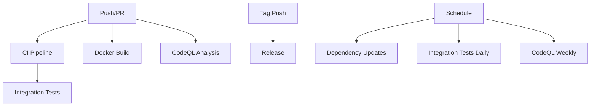

# GitHub Actions CI/CD Pipeline

This directory contains the complete CI/CD pipeline configuration for the MongoDB Kafka Data Streaming project.

## 🚀 Workflows Overview

### 1. CI Pipeline (`ci.yml`)
**Triggers**: Push to main/develop, Pull Requests to main

**Jobs**:
- **Test**: Unit tests with MongoDB service
- **Security**: OWASP dependency vulnerability scanning
- **Build**: Maven build and artifact creation

**Features**:
- Maven dependency caching
- Test result reporting
- Code coverage with Codecov
- Artifact uploads

### 2. Docker Build & Push (`docker.yml`)
**Triggers**: Push to main, Tags, Pull Requests

**Features**:
- Multi-platform builds (AMD64, ARM64)
- GitHub Container Registry publishing
- Docker image vulnerability scanning with Trivy
- Metadata extraction and tagging

### 3. Release Automation (`release.yml`)
**Triggers**: Git tags (v*)

**Features**:
- Automated release creation
- Changelog generation
- Artifact attachment (JAR, Docker configs)
- Release notes generation

### 4. Security Analysis (`codeql.yml`)
**Triggers**: Push, Pull Requests, Weekly schedule

**Features**:
- GitHub CodeQL security analysis
- Java code scanning
- Security and quality queries
- Automated vulnerability detection

### 5. Integration Tests (`integration-test.yml`)
**Triggers**: Push, Pull Requests, Daily schedule

**Features**:
- Full environment testing with Docker Compose
- Real MongoDB and Kafka integration
- End-to-end pipeline validation
- Test result artifacts

### 6. Dependency Updates (`dependency-update.yml`)
**Triggers**: Weekly schedule, Manual dispatch

**Features**:
- Automated Maven dependency updates
- Pull request creation for updates
- Security-focused dependency management

## 🔧 Setup Requirements

### Repository Secrets
No additional secrets required - uses `GITHUB_TOKEN` for all operations.

### Branch Protection
Recommended branch protection rules for `main`:
- Require status checks to pass
- Require branches to be up to date
- Require review from code owners
- Restrict pushes to matching branches

### Repository Settings
Enable the following in repository settings:
- **Actions**: Allow all actions and reusable workflows
- **Packages**: Enable GitHub Packages
- **Security**: Enable Dependabot alerts and security updates

## 📊 Status Badges

Add these badges to your README.md:

```markdown


```

## 🔄 Workflow Dependencies



## 🛠️ Local Testing

Test workflows locally using [act](https://github.com/nektos/act):

```bash
# Install act
curl https://raw.githubusercontent.com/nektos/act/master/install.sh | sudo bash

# Run CI workflow
act push

# Run specific job
act -j test

# Run with secrets
act -s GITHUB_TOKEN=your_token
```

## 📈 Monitoring & Metrics

### Workflow Metrics
- **Build Success Rate**: Monitor via GitHub Actions dashboard
- **Test Coverage**: Tracked via Codecov integration
- **Security Vulnerabilities**: CodeQL and OWASP reports
- **Dependency Freshness**: Weekly automated updates

### Performance Benchmarks
- **CI Pipeline**: ~5-8 minutes
- **Docker Build**: ~3-5 minutes
- **Integration Tests**: ~10-15 minutes
- **Security Scan**: ~2-3 minutes

## 🔒 Security Features

### Automated Security Scanning
- **CodeQL**: Static analysis for security vulnerabilities
- **OWASP**: Dependency vulnerability scanning
- **Trivy**: Container image vulnerability scanning
- **Dependabot**: Automated security updates

### Security Best Practices
- Minimal permissions for workflows
- No hardcoded secrets
- Secure artifact handling
- Regular security updates

## 🚨 Troubleshooting

### Common Issues

**Build Failures**:
- Check Maven dependency conflicts
- Verify Java version compatibility
- Review test environment setup

**Docker Build Issues**:
- Validate Dockerfile syntax
- Check multi-platform compatibility
- Verify base image availability

**Integration Test Failures**:
- Ensure Docker Compose services start correctly
- Check port conflicts
- Verify service health checks

### Debug Commands

```bash
# Check workflow logs
gh run list
gh run view <run-id>

# Re-run failed jobs
gh run rerun <run-id>

# Check repository settings
gh repo view --json defaultBranchRef,hasIssuesEnabled,hasWikiEnabled
```

## 📚 Additional Resources

- [GitHub Actions Documentation](https://docs.github.com/en/actions)
- [Maven CI/CD Best Practices](https://maven.apache.org/guides/introduction/introduction-to-the-lifecycle.html)
- [Docker Multi-platform Builds](https://docs.docker.com/build/building/multi-platform/)
- [CodeQL Documentation](https://codeql.github.com/docs/)