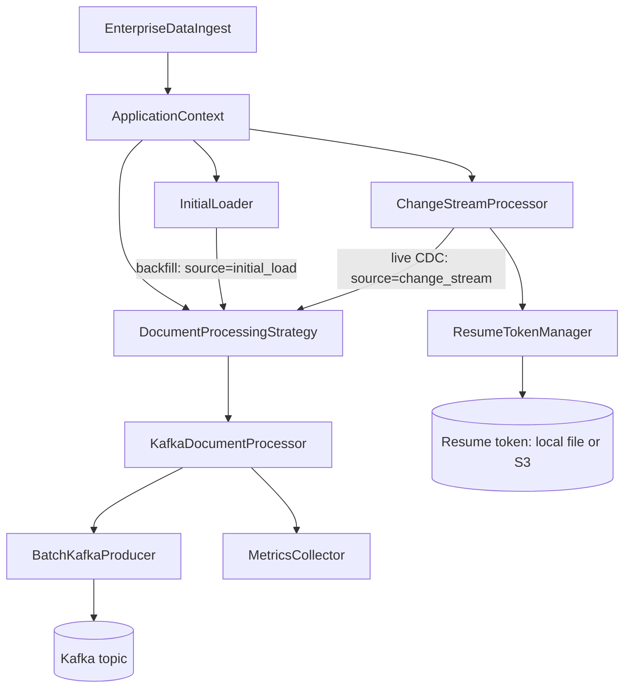

# Modular Architecture in MongoDB to Kafka CDC

This document explains the modular architecture of the MongoDB to Kafka CDC application, highlighting how the code is organized into cohesive modules with clear responsibilities and well-defined interfaces.

## Package Structure

The application follows a modular package structure that separates concerns and promotes maintainability:

```
com.github.ghoshp83.mongokafkastream
├── config       # Configuration classes
│   ├── AppConfig.java
│   ├── Config.java
│   └── ConfigLoader.java
├── core         # Core business logic
│   ├── ApplicationContext.java   # Wires the components together
│   ├── DocumentLogger.java
│   ├── kafka    # Kafka-related components
│   │   ├── BatchKafkaProducer.java
│   │   └── KafkaProducerFactory.java
│   ├── metrics  # Metrics collection
│   │   └── MetricsCollector.java
│   ├── mongo    # MongoDB-related components
│   │   ├── ChangeStreamProcessor.java
│   │   ├── InitialLoader.java
│   │   ├── LocalResumeTokenManager.java
│   │   ├── MongoConnectionPool.java
│   │   ├── MongoFactory.java
│   │   ├── ResumeTokenManager.java
│   │   ├── ResumeTokenManagerFactory.java
│   │   └── S3ResumeTokenManager.java
│   ├── process  # Document processing logic
│   │   ├── DocumentProcessingStrategy.java
│   │   └── KafkaDocumentProcessor.java
│   ├── resilience # Resilience patterns
│   │   ├── CircuitBreaker.java
│   │   └── CircuitBreakerOpenException.java
│   └── shutdown # Shutdown management
│       ├── GracefulShutdown.java
│       └── GracefulShutdownManager.java
├── health       # Health check components
│   ├── ComponentHealth.java
│   ├── HealthCheckServer.java
│   ├── HealthCheckService.java
│   └── HealthStatus.java
├── util         # Utility classes
│   ├── DocumentConverter.java
│   └── JsonConverter.java
└── EnterpriseDataIngest.java  # Main application class
```

## Core Modules

### Processing Module

The `core.process` package defines the contract between the MongoDB readers and
whatever consumes the documents they emit:

```java
// DocumentProcessingStrategy.java
public interface DocumentProcessingStrategy extends AutoCloseable {
    void processDocument(Document document, String operation, String source);

    // Lets the application flush the Kafka producer during shutdown.
    @Override
    default void close() {
    }
}
```

### Config Module

The Config module handles loading and managing application configuration:

```java
// Config.java
@Getter
@ToString
public class Config {
    private final String mongodbUri;
    private final String mongodbDatabase;
    // Other configuration properties
    
    @Builder
    private Config(String mongodbUri, String mongodbDatabase, /* other params */) {
        this.mongodbUri = mongodbUri;
        this.mongodbDatabase = mongodbDatabase;
        // Initialize other properties
    }
}

// ConfigLoader.java
public class ConfigLoader {
    public static Config loadFromEnv() {
        // Load from environment variables
    }
    
    public static Config loadFromPropertiesFile(String path) {
        // Load from properties file
    }
}
```

### Core Module

The Core module contains the main business logic of the application:

```java
// ApplicationContext.java
@Slf4j
@Getter
public class ApplicationContext implements AutoCloseable {
    // Configuration
    private final Config config;
    
    // Core components
    private final MongoClient mongoClient;
    private final KafkaProducer<String, String> kafkaProducer;
    // Other components
    
    public ApplicationContext(Config config) {
        this.config = config;
        // Initialize components
    }
}

// InitialLoader.java
@Slf4j
@RequiredArgsConstructor
public class InitialLoader {
    private final MongoClient mongoClient;
    private final Config config;
    private final MetricsCollector metricsCollector;
    private final DocumentProcessingStrategy processingStrategy;
    
    public void load() throws Exception {
        // Load documents from MongoDB to Kafka
    }
}
```

### Kafka Module

The Kafka module handles interaction with Apache Kafka:

```java
// KafkaProducerFactory.java
public class KafkaProducerFactory {
    public static KafkaProducer<String, String> createProducer(Config config) {
        // Create and configure Kafka producer
    }
}

// BatchKafkaProducer.java
@Slf4j
@RequiredArgsConstructor
public class BatchKafkaProducer {
    private final KafkaProducer<String, String> producer;
    private final String topic;
    private final int batchSize;
    
    public void send(String key, String value) {
        // Send message to batch
    }
    
    public void flush() {
        // Flush batch to Kafka
    }
}
```

### MongoDB Module

The MongoDB module handles interaction with MongoDB:

```java
// MongoConnectionPool.java
@Slf4j
public class MongoConnectionPool {
    private static volatile MongoClient sharedClient;
    
    public static MongoClient getClient(Config config) {
        // Get or create MongoDB client
    }
    
    public static void closeClient() {
        // Close MongoDB client
    }
}
```

### Process Module

The Process module handles document processing logic:

```java
// KafkaDocumentProcessor.java — the strategy implementation the app wires up
@Slf4j
@RequiredArgsConstructor
public class KafkaDocumentProcessor implements DocumentProcessingStrategy {
    private final BatchKafkaProducer kafkaProducer;
    private final MetricsCollector metricsCollector;

    @Override
    public void processDocument(Document document, String operation, String source) {
        // Key on vuid when present, otherwise _id; wrap the document in an
        // _operation/_source/_timestamp envelope; hand it to the batch producer.
    }

    @Override
    public void close() {
        kafkaProducer.flush();
    }
}
```

### Resilience Module

The Resilience module provides patterns for handling failures:

```java
// CircuitBreaker.java
@Slf4j
public class CircuitBreaker {
    private final String name;
    private final int failureThreshold;
    private final long resetTimeoutMs;
    
    public <T> T execute(Supplier<T> action) throws Exception {
        // Execute with circuit breaker protection
    }
}
```

### Metrics Module

The Metrics module collects and reports performance metrics:

```java
// MetricsCollector.java
@Slf4j
public class MetricsCollector {
    private final Map<String, Counter> counters = new ConcurrentHashMap<>();
    private final Map<String, Timer> timers = new ConcurrentHashMap<>();
    
    public void incrementCounter(String name) {
        // Increment counter
    }
    
    public Timer startTimer(String name) {
        // Start timer
    }
}
```

### Shutdown Module

The Shutdown module manages graceful application shutdown:

```java
// GracefulShutdown.java
@Slf4j
public class GracefulShutdown {
    private final List<ShutdownTask> shutdownTasks = new ArrayList<>();
    
    public void addShutdownTask(Runnable task, String taskName) {
        // Add shutdown task
    }
    
    public boolean waitForCompletion(long timeoutSeconds) {
        // Wait for tasks to complete
    }
}
```

### Health Module

The Health module provides health check endpoints:

```java
// HealthCheckServer.java
@Slf4j
public class HealthCheckServer {
    private final int port;
    private final AtomicBoolean healthy = new AtomicBoolean(true);
    
    public void start() {
        // Start health check server
    }
    
    public void stop() {
        // Stop health check server
    }
}
```

### Util Module

The Util module provides utility classes:

```java
// DocumentConverter.java
@Slf4j
public class DocumentConverter {
    public static JSONObject convertToJsonObject(Document document) {
        // Convert MongoDB document to JSON
    }
    
    public static String extractId(Document document) {
        // Extract document ID
    }
}
```

## Component Interactions

The following diagram illustrates how the main components interact:



Both readers write through the same `DocumentProcessingStrategy`, which is why
a backfilled document and a live change event arrive on the topic in the same
shape — distinguishable only by the `_source` field in the metadata envelope.

## Benefits of Modular Architecture

### 1. Separation of Concerns

Each module has a clear responsibility:
- **Config**: Manages configuration
- **Core**: Implements business logic
- **Kafka**: Handles Kafka interaction
- **MongoDB**: Handles MongoDB interaction
- **Process**: Manages document processing
- **Resilience**: Provides failure handling
- **Metrics**: Collects performance data
- **Shutdown**: Manages application shutdown
- **Health**: Provides health checks
- **Util**: Provides utility functions

### 2. Maintainability

- **Localized changes**: Changes to one module don't affect others
- **Focused testing**: Each module can be tested independently
- **Clear dependencies**: Dependencies between modules are explicit
- **Reduced complexity**: Each module is simpler than the whole system

### 3. Extensibility

- **New implementations**: New implementations of interfaces can be added easily
- **Additional modules**: New modules can be added without changing existing ones
- **Feature toggles**: Features can be enabled or disabled through configuration
- **Alternative backends**: Different storage or messaging systems can be supported

### 4. Reusability

- **Shared components**: Common functionality is extracted into reusable components
- **Clear interfaces**: Well-defined interfaces enable component reuse
- **Utility classes**: General-purpose utilities can be used across the application
- **Design patterns**: Common patterns are implemented consistently

## Conclusion

The modular architecture of the MongoDB to Kafka CDC application provides several benefits:

1. **Clear organization**: Code is organized into cohesive modules with specific responsibilities
2. **Loose coupling**: Modules interact through well-defined interfaces
3. **Flexibility**: Components can be replaced or extended without affecting the entire system
4. **Testability**: Modules can be tested in isolation with mock dependencies
5. **Maintainability**: Changes are localized to specific modules

This architecture makes the application easier to understand, maintain, and extend, while also improving code quality and reducing the risk of introducing bugs when making changes.
